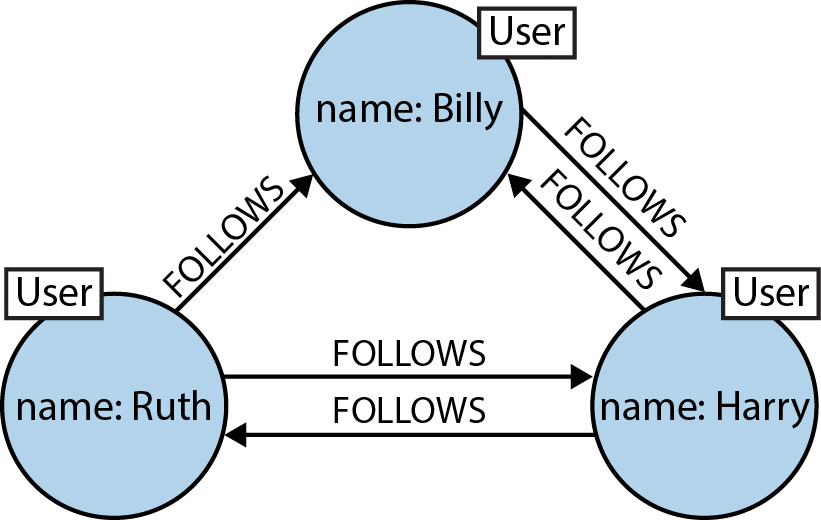

Tidy Data
=========

csv files
---------

```
# populations.csv

state          , population
California     , 38332521
Texas          , 26448193
New York       , 19651127
Florida        , 19552860
Illinois       , 12882135
Pennsylvania   , 12773801
Ohio           , 11570808
Georgia        , 9992167
Michigan       , 9895622
North Carolina , 9848060
New Jersey     , 8899339
...
```


tabular or relational databases (sql)
-------------------------------------

```
# populations.csv

state   , population , county                 , population
Montana , 1032949    , Yellowstone County     , 157048
Montana , 1032949    , Missoula County        , 114181
Montana , 1032949    , Gallatin County        , 100739
Montana , 1032949    , Flathead County        , 96165
Montana , 1032949    , Cascade County         , 82278
Montana , 1032949    , Lewis and Clark County , 66418
...
```

. . .

```
SELECT C.county, S.year_founded
FROM Counties C
JOIN States S on S.state = C.state
```


graph databases
---------------




Components of a graph
---------------------

- nodes
    - nodes have properties
- relationships 
    - relationships connect two nodes
    - relationships can have properties


Benefits of graph
-----------------

- Graph databases are efficient for highly connected data
- Graph queries are often simpler than SQL counterparts
- Model/schema is probably closer to _truth_ with graph
- Your thought process with graph will be different


How do we use graph?
--------------------

- Exploring and visualize the graph itself
- Querying the graph for sub-graphs
- Sub-graphs may be expressed as a table


Our first graph database
========================

neo4j
-----

neo4j: [https://neo4j.com/](https://neo4j.com/)

neo4j running: [http://localhost:7474/](http://localhost:7474/)

neo4j R driver: [https://github.com/nicolewhite/RNeo4j](https://github.com/nicolewhite/RNeo4j)

neo4j cypher documentation:
[https://neo4j.com/docs/developer-manual/current/cypher/](https://neo4j.com/docs/developer-manual/current/cypher/)


Example
=======

Scenario
--------

- Record the ID's of sheep when they come into contact

. . .

[github.com/useRbozeman/intro-to-graphdb](http://github.com/useRbozeman/intro-to-graphdb)

data > contacts.csv


Question 1
----------

- Find me the sheep who have contacted the most other sheep?

Question 2
----------

- Find me the sheep who have have the most up-to-second order contacts?

Question 3
----------

- Find me the shortest contact path between sheep 1 and sheep 2

Question 4
----------

- Expansion: I want to weight the contacts by duration of contact.

- Who has most total contact time?

[github.com/useRbozeman/intro-to-graphdb](http://github.com/useRbozeman/intro-to-graphdb)

data > graph1.csv


Example
=======

Scenario
--------

A single contact event can include more than two sheep

. . .

[github.com/useRbozeman/intro-to-graphdb](http://github.com/useRbozeman/intro-to-graphdb)

data > graph2.csv

Question 1
----------

- Which sheep have the largest average (in number of contacts) contact event?

Question 2
----------

- Which sheep have very little contact?

Example
=======

Scenario
--------

Contact with other things!


Question 1
----------

- What are all the things the sheep has had contact with?


